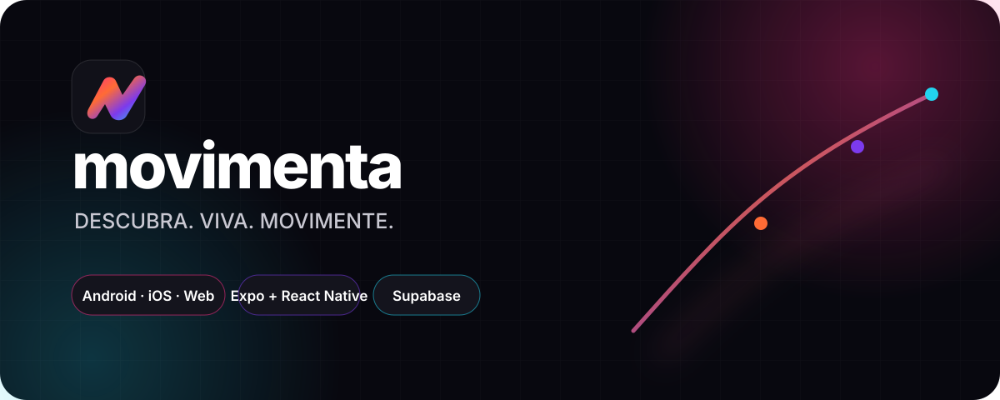
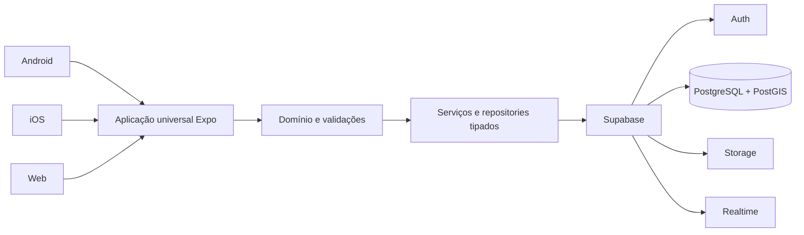
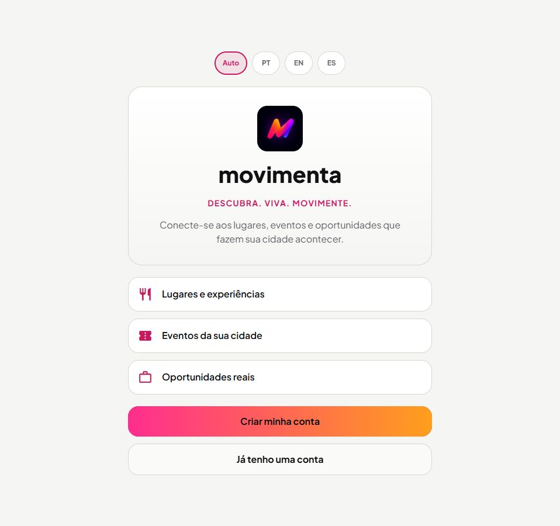
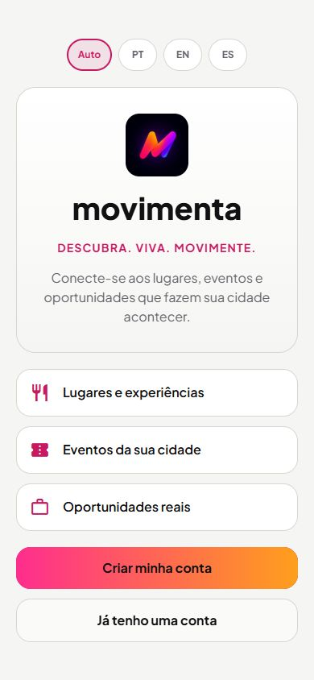
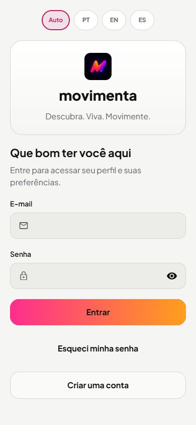

  

# Movimenta

**Uma plataforma universal para descobrir lugares, viver experiências e encontrar oportunidades na cidade.**

O Movimenta é um produto digital da **Halz Tech**, desenvolvido com uma única base de código para Android, iOS e web. O projeto combina experiência visual responsiva, identidade de usuário, localização e uma fundação segura de dados para conectar pessoas ao que acontece ao redor delas.

> O produto está em desenvolvimento ativo. Este repositório apresenta decisões técnicas e resultados verificáveis sem expor o código-fonte privado, credenciais, dados de usuários ou regras de negócio proprietárias.

## Visão do produto

O Movimenta foi concebido como um produto completo e evolutivo, não como uma demonstração descartável. Cada fase amplia a mesma arquitetura de produção, preservando integração, segurança, acessibilidade e consistência entre plataformas.

A fundação atual contempla:

- autenticação real, confirmação de e-mail e recuperação de acesso;
- onboarding com papéis, interesses e preferências;
- perfil persistido, avatar protegido e gerenciamento de conta;
- temas claro, escuro e preferência do sistema;
- internacionalização para português, inglês e espanhol;
- localização e seleção estruturada de municípios;
- cadastro e administração de locais;
- reivindicação de propriedade e fluxo de moderação;
- catálogo de locais com procedência e base para integrações externas;
- políticas de acesso no banco e trilhas de auditoria.

## Arquitetura

A interface não consulta o banco de forma dispersa. Regras de domínio, autenticação, validação, estado e acesso a dados são separados em camadas, com contratos TypeScript e políticas de segurança aplicadas no backend.

Leia mais em [Arquitetura](docs/architecture.md).

## Stack principal

### Aplicação universal

- Expo e React Native
- TypeScript em modo estrito
- Expo Router
- componentes compartilhados entre Android, iOS e web
- sistema visual responsivo e acessível

### Plataforma de dados

- Supabase
- PostgreSQL e PostGIS
- migrations SQL versionadas
- Row Level Security
- Supabase Auth, Storage e Realtime
- Edge Functions em TypeScript quando o domínio exigir execução segura no servidor

## Qualidade verificada

A fundação técnica é validada continuamente em ambiente local reproduzível:

- **229 testes de banco e RLS** aprovados;
- testes de integração do ciclo de identidade, perfil, armazenamento e conta;
- **42 testes automatizados de frontend** aprovados;
- lint e TypeScript sem erros;
- **Expo Doctor: 21/21 verificações**;
- exportação web validada com **52 rotas**.

Esses números registram a última validação completa do projeto em agosto de 2026.

## Segurança e privacidade

- privilégios mínimos e isolamento de dados por usuário;
- operações administrativas condicionadas a autorização real;
- credenciais privilegiadas nunca embarcadas no aplicativo;
- uploads com controle de proprietário e políticas de acesso;
- migrations e políticas revisadas por testes automatizados;
- nenhum segredo, dado pessoal real ou dump de banco neste repositório.

Veja [Segurança e qualidade](docs/security-and-quality.md).

## Sistema visual

A direção visual **Neon Joia** combina base editorial em grafite, contraste alto e acentos vibrantes em rosa, laranja, roxo e ciano. O sistema possui tokens reutilizáveis, temas claro/escuro/sistema e comportamento responsivo entre celular e desktop.

Veja [Sistema visual](docs/visual-system.md).

## Interface real

Capturas realizadas diretamente no aplicativo em execução local, sem contas, credenciais ou dados pessoais. A mesma interface se adapta aos diferentes tamanhos de tela.

### Apresentação no desktop

  

### Experiência mobile

  
  &nbsp;&nbsp;
  

## Documentação do showcase

- [Arquitetura](docs/architecture.md)
- [Capacidades implementadas](docs/features.md)
- [Segurança e qualidade](docs/security-and-quality.md)
- [Sistema visual](docs/visual-system.md)

## Sobre este repositório

O código-fonte de produção permanece em repositórios privados. Este showcase documenta a engenharia do produto em nível suficiente para avaliação profissional, sem transferir propriedade intelectual sensível.

**Produto:** Movimenta  
**Empresa:** Halz Tech  
**Responsável:** [Pedro Bruno Amorim](https://github.com/pedrobrunoamorim)

---

© 2026 Pedro Bruno Amorim / Halz Tech. Todos os direitos reservados.
