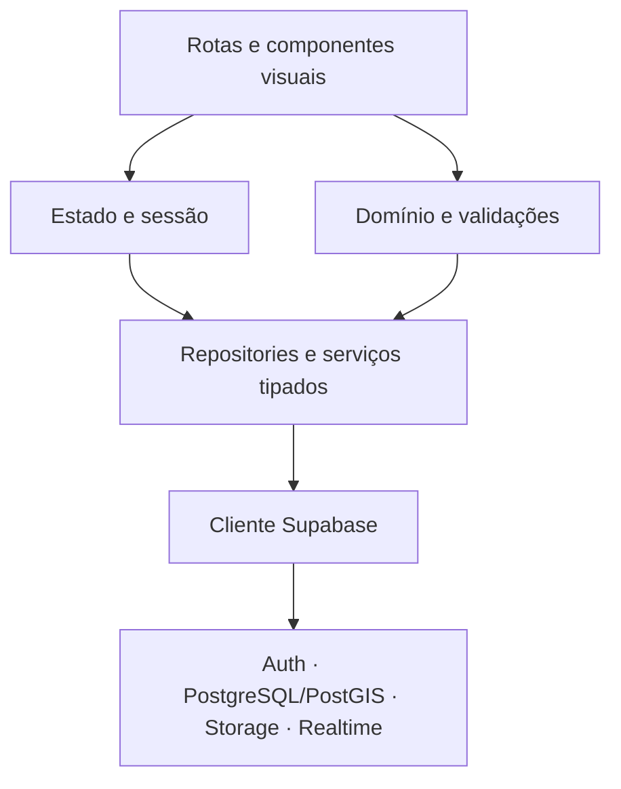
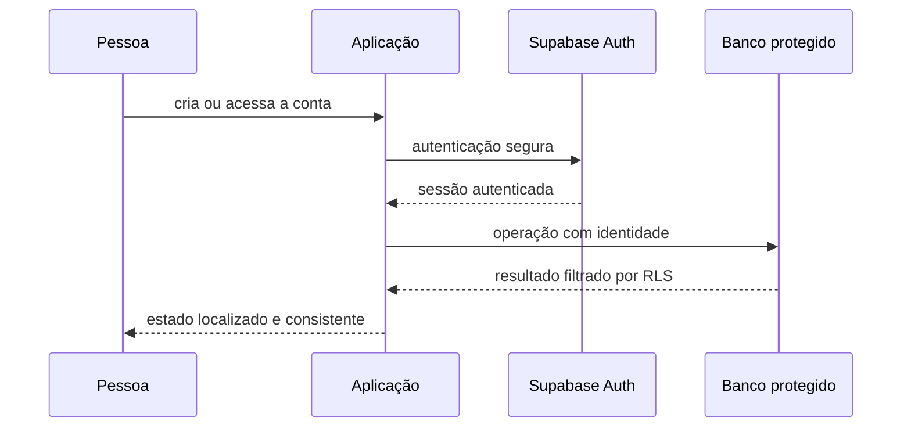

# Arquitetura do Movimenta

## Objetivo técnico

Sustentar Android, iOS e web com a mesma base de produto, mantendo regras de negócio independentes da interface e controles de segurança próximos dos dados.

## Visão em camadas

### Interface e navegação

O Expo Router organiza rotas universais e fluxos protegidos. Componentes reutilizáveis recebem dados e ações por propriedades, sem concentrar consultas ou regras de autorização.

### Domínio e validações

Regras de entrada, estados permitidos e transformações são centralizados. Essa separação reduz divergências entre telas e torna o comportamento verificável.

### Acesso a dados

Repositories tipados encapsulam autenticação, persistência, uploads e consultas. A aplicação consome contratos estáveis; detalhes do provedor ficam isolados.

### Plataforma Supabase

O PostgreSQL é a fonte de verdade. Migrations versionam a evolução do banco, Row Level Security restringe operações por identidade e propriedade, e o Storage aplica o mesmo princípio aos arquivos.

## Princípios adotados

- uma base de código para três plataformas;
- TypeScript estrito e contratos explícitos;
- migrations reproduzíveis;
- segurança em profundidade: cliente, domínio e banco;
- privilégio mínimo;
- estados vazios e erros tratados como situações reais;
- internacionalização integrada;
- acessibilidade e responsividade como requisitos de base;
- dados de desenvolvimento isolados do código de produção.

## Fluxo de identidade

O token da sessão identifica o usuário; ele não substitui as políticas do banco. Dados privados e ações administrativas continuam protegidos pelo backend.

## Evolução

Novos módulos entram pelas mesmas fronteiras: rota, domínio, repository e migration/política quando necessário. Isso permite ampliar o produto sem criar um backend paralelo ou reescrever a fundação.
